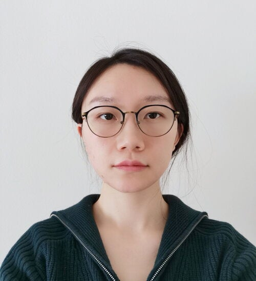

```{=html}
<style>
.contributor-grid {
  display: grid;
  grid-template-columns: repeat(auto-fill, minmax(110px, 1fr));
  gap: 1.25rem 1rem;
  margin: 1.25rem 0 2rem;
}
.contributor-card {
  display: flex;
  flex-direction: column;
  align-items: center;
  text-align: center;
  gap: 0.5rem;
}
.contributor-avatar {
  width: 72px;
  height: 72px;
  border-radius: 50%;
  overflow: hidden;
  flex-shrink: 0;
  background: #e9ecef;
}
.contributor-avatar img {
  width: 100%;
  height: 100%;
  object-fit: cover;
  display: block;
}
.contributor-initials {
  width: 100%;
  height: 100%;
  align-items: center;
  justify-content: center;
  font-size: 1.2rem;
  font-weight: 600;
  color: #fff;
  background: #2780e3;
  font-family: inherit;
}
.contributor-name {
  font-size: 0.82rem;
  line-height: 1.3;
}
.contributor-name a {
  color: #212529;
  text-decoration: none;
}
.contributor-name a:hover {
  color: #2780e3;
}
</style>
```

- Information about datasets (including links and citations) is available on the [Documentation page](docs.qmd). Code used to generate harmonized datasets can be found on [GitHub](https://github.com/ben-domingue/irw).

- Funding for the IRW was provided by the Stanford Office of the Vice Provost and Dean of Research (VPDoR) and the Jacobs Foundation. Thank you to these funders!

- **A [manuscript](https://link.springer.com/article/10.3758/s13428-025-02796-y) describing the IRW is available.**

- [This website](https://github.com/datapages/irw) is built with [Quarto](https://quarto.org/), interactive visualizations in [Observable](https://observablehq.com/), hosted on [GitHub Pages](https://docs.github.com/en/pages/getting-started-with-github-pages/about-github-pages), and data stored on [Redivis](https://redivis.com/).

- To access data directly on Redivis, see the [guide to getting started](https://docs.redivis.com/guides/getting-started).

If you use IRW data, please cite the manuscript above. Thank you!

# Contributors

The IRW was created by [Ben Domingue](https://profiles.stanford.edu/benjamin-domingue) (Graduate School of Education, Stanford University), with this website built in collaboration with [Mike Frank](http://web.stanford.edu/~mcfrank/) and [Mika Braginsky](https://mikabr.io/) (Psychology Department, Stanford University).

```{=html}
<div class="contributor-grid">

<div class="contributor-card">
  <div class="contributor-avatar">
    
    <div class="contributor-initials" style="display:none">BD</div>
  </div>
  <div class="contributor-name"><a href="https://profiles.stanford.edu/benjamin-domingue" target="_blank">Ben Domingue</a></div>
</div>

<div class="contributor-card">
  <div class="contributor-avatar">
    
    <div class="contributor-initials" style="display:none">MF</div>
  </div>
  <div class="contributor-name"><a href="http://web.stanford.edu/~mcfrank/" target="_blank">Mike Frank</a></div>
</div>

<div class="contributor-card">
  <div class="contributor-avatar">
    
    <div class="contributor-initials" style="display:none">MB</div>
  </div>
  <div class="contributor-name"><a href="https://mikabr.io/" target="_blank">Mika Braginsky</a></div>
</div>

<div class="contributor-card">
  <div class="contributor-avatar">
    
    <div class="contributor-initials" style="display:none">AP</div>
  </div>
  <div class="contributor-name">Arthur Pan</div>
</div>

<div class="contributor-card">
  <div class="contributor-avatar">
    
    <div class="contributor-initials" style="display:none">RL</div>
  </div>
  <div class="contributor-name">Rochelle Lundy</div>
</div>

<div class="contributor-card">
  <div class="contributor-avatar">
    
    <div class="contributor-initials" style="display:none">SZ</div>
  </div>
  <div class="contributor-name"><a href="https://psychology.illinois.edu/directory/profile/szhan105" target="_blank">Susu Zhang</a></div>
</div>

<div class="contributor-card">
  <div class="contributor-avatar">
    
    <div class="contributor-initials" style="display:none">KK</div>
  </div>
  <div class="contributor-name"><a href="https://klintkanopka.com" target="_blank">Klint Kanopka</a></div>
</div>

<div class="contributor-card">
  <div class="contributor-avatar">
    
    <div class="contributor-initials" style="display:none">LC</div>
  </div>
  <div class="contributor-name">Lucy Caffrey-Maffei</div>
</div>

<div class="contributor-card">
  <div class="contributor-avatar">
    
    <div class="contributor-initials" style="display:none">LZ</div>
  </div>
  <div class="contributor-name"><a href="https://lijinzhang.com/" target="_blank">Lijin Zhang</a></div>
</div>

<div class="contributor-card">
  <div class="contributor-avatar">
    
    <div class="contributor-initials" style="display:none">YL</div>
  </div>
  <div class="contributor-name">Yiqing Liu</div>
</div>

<div class="contributor-card">
  <div class="contributor-avatar">
    
    <div class="contributor-initials" style="display:none">HY</div>
  </div>
  <div class="contributor-name">Hang Yu</div>
</div>

<div class="contributor-card">
  <div class="contributor-avatar">
    
    <div class="contributor-initials" style="display:none">JG</div>
  </div>
  <div class="contributor-name"><a href="https://scholar.google.com/citations?user=OCdG4IgAAAAJ&hl=en" target="_blank">Josh Gilbert</a></div>
</div>

<div class="contributor-card">
  <div class="contributor-avatar">
    
    <div class="contributor-initials" style="display:none">SN</div>
  </div>
  <div class="contributor-name"><a href="https://www.linkedin.com/in/saviranadela/" target="_blank">Savira Dwia Nadela</a></div>
</div>

<div class="contributor-card">
  <div class="contributor-avatar">
    
    <div class="contributor-initials" style="display:none">RK</div>
  </div>
  <div class="contributor-name"><a href="https://scholar.google.com/citations?user=rpM1LoEAAAAJ&hl=en&oi=ao" target="_blank">Radhika Kapoor</a></div>
</div>

<div class="contributor-card">
  <div class="contributor-avatar">
    
    <div class="contributor-initials" style="display:none">JM</div>
  </div>
  <div class="contributor-name">João Moreira</div>
</div>

<div class="contributor-card">
  <div class="contributor-avatar">
    
    <div class="contributor-initials" style="display:none">HL</div>
  </div>
  <div class="contributor-name"><a href="https://scholar.google.com/citations?user=vmcet8AAAAAJ&hl=en" target="_blank">Hansol Lee</a></div>
</div>

<div class="contributor-card">
  <div class="contributor-avatar">
    
    <div class="contributor-initials" style="display:none">MH</div>
  </div>
  <div class="contributor-name"><a href="https://www.linkedin.com/in/michael-hardy-education/" target="_blank">Mike Hardy</a></div>
</div>

<div class="contributor-card">
  <div class="contributor-avatar">
    
    <div class="contributor-initials" style="display:none">HW</div>
  </div>
  <div class="contributor-name"><a href="https://whxiao210.github.io/" target="_blank">Huanxiao Wang</a></div>
</div>

<div class="contributor-card">
  <div class="contributor-avatar">
    
    <div class="contributor-initials" style="display:none">SE</div>
  </div>
  <div class="contributor-name">Samuel Enrique</div>
</div>

<div class="contributor-card">
  <div class="contributor-avatar">
    
    <div class="contributor-initials" style="display:none">XZ</div>
  </div>
  <div class="contributor-name">Xingyi Zhang</div>
</div>

<div class="contributor-card">
  <div class="contributor-avatar">
    
    <div class="contributor-initials" style="display:none">MS</div>
  </div>
  <div class="contributor-name"><a href="https://www.linkedin.com/in/mathbecsan/" target="_blank">Mathias Becerra Sanchez</a></div>
</div>

<div class="contributor-card">
  <div class="contributor-avatar">
    
    <div class="contributor-initials" style="display:none">RS</div>
  </div>
  <div class="contributor-name">Rubina Shrestha</div>
</div>

<div class="contributor-card">
  <div class="contributor-avatar">
    
    <div class="contributor-initials" style="display:none">LA</div>
  </div>
  <div class="contributor-name">Luis Anunciação</div>
</div>

<div class="contributor-card">
  <div class="contributor-avatar">
    
    <div class="contributor-initials" style="display:none">AG</div>
  </div>
  <div class="contributor-name">Ayaan Gupta</div>
</div>

<div class="contributor-card">
  <div class="contributor-avatar">
    
    <div class="contributor-initials" style="display:none">NJ</div>
  </div>
  <div class="contributor-name">Nishka Jain</div>
</div>

<div class="contributor-card">
  <div class="contributor-avatar">
    
    <div class="contributor-initials" style="display:none">NB</div>
  </div>
  <div class="contributor-name">Nomin-Erdene Bayarsaikhan</div>
</div>

<div class="contributor-card">
  <div class="contributor-avatar">
    
    <div class="contributor-initials" style="display:none">FR</div>
  </div>
  <div class="contributor-name">Frances Raphael</div>
</div>

<div class="contributor-card">
  <div class="contributor-avatar">
    
    <div class="contributor-initials" style="display:none">AT</div>
  </div>
  <div class="contributor-name">Aanya Tashfeen</div>
</div>

</div>
```
